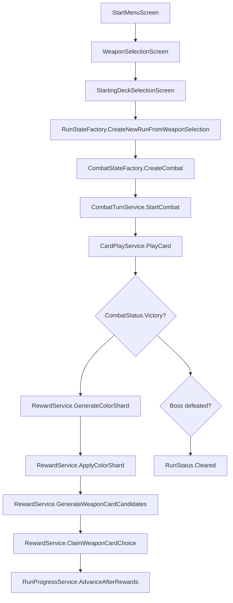

# 《剑与黑塔》MVP 程序调用链路

本文记录当前 Godot / C# MVP 的正式运行链路。正式主流程以武器卡池、彩能、色彩附魔和武器卡三选一奖励为基线；旧连锁、技能牌和卡牌包奖励不再作为 `game/data/gameplay/` 的运行数据共存，仅保留必要兼容字段。

## 运行环境

- Godot：`4.6.3.stable.mono` 或同系列 Godot 4.6.x .NET 版。
- .NET SDK：`8.0.x`，项目目标框架为 `net8.0`。

常用验证命令：

```bash
dotnet build RoguelikeCardGame.csproj -v:minimal
dotnet run --project tests/Unit/RoguelikeCardGame.Tests.csproj
python tools/data_validator/validate_data.py
godot-mono --headless --path . --quit
```

## 总览调用图



## 关键数据

- `game/data/gameplay/weapons/weapons.json`：正式 MVP 武器入口，当前包含左轮剑和机械臂。
- `game/data/gameplay/cards/cards.json`：正式 MVP 卡牌池，只允许行动牌和终结牌，每张牌带 `weapon_id`。
- `game/data/gameplay/colors/colors.json`：红、黄、蓝、绿、紫五色定义。黄色只表示增加卡牌释放次数。
- `game/data/gameplay/card_pools/card_pools.json`：每种武器的 8 张起始池，以及按武器和稀有度组织的奖励池。
- `game/data/gameplay/encounters/`、`enemies/`、`relics/`、`runs/`：正式 MVP 遭遇、魔物、遗物和线性 Run 数据。

## 开局流程

`MvpRunFlowController.StartNewRun` 不再读取固定 `starter_deck`。流程为：

1. `WeaponSelectionScreen` 选择主手武器和副手武器。
2. `StartingDeckSelectionScreen` 从主手 8 张起始池选择 6 张，从副手 8 张起始池选择 4 张。
3. `StartingDeckSelectionService.Validate` 校验数量、武器归属和重复张数。
4. `RunStateFactory.CreateNewRunFromWeaponSelection` 创建 10 张 `CardInstance`，写入 `MainHandWeaponId`、`OffHandWeaponId`、`MasterDeckInstances` 和附魔状态。

## 战斗流程

战斗状态由 `CombatStateFactory.CreateCombat` 创建，并由 `CombatTurnService.StartCombat` 进入玩家回合。`CombatState` 保存玩家生命、防御、行动点、牌区、魔物状态、日志和 6 格 `ColorEnergyPool`。

`CardPlayService.PlayCard` 是出牌结算入口：

- 行动牌消耗行动点，结算基础效果。
- 行动牌根据自身附魔颜色生成彩能；未附魔时生成无色彩能。
- 行动牌附魔颜色也会触发对应颜色追加效果。
- 终结牌检查并消耗彩能，不读取旧阈值。
- 终结牌按实际消耗的颜色逐一结算追加效果。

颜色边界：

- 红色：提高伤害，或把防御 / 控制收益的一部分转为伤害。
- 黄色：增加卡牌释放次数，单次结算有硬上限，不抽牌、不返还行动点、不回能量。
- 蓝色：按最终伤害或最终效果值获得防御。
- 绿色：按最终伤害或最终效果值回复生命，不能超过最大生命。
- 紫色：放大最终效果，有硬上限，不能无限循环。

## 奖励流程

普通和精英战斗胜利后不再打开卡牌包。新版奖励由 `RewardService` 分三步处理：

1. `GenerateColorShard` 生成随机色彩碎片，并通过 `AddPendingColorShard` 进入 `RunState.PendingColorShards`。
2. `ListEnchantableActionCards` 列出当前牌组中未附魔行动牌；`ApplyColorShard` 把碎片写入目标 `CardInstance.Enchantment`。
3. `GenerateWeaponCardCandidates` 从主手 / 副手武器奖励池生成 3 张候选；`ClaimWeaponCardChoice` 必须选择 1 张作为新 `CardInstance` 加入牌组。

精英战斗仍可通过 `GrantEncounterRelic` 发放固定遗物。Boss 胜利由 `RunProgressService.ApplyCombatResult` 设置为 `RunStatus.Cleared`；玩家生命归零设置为 `RunStatus.Failed`。

## Debug / Metrics

`PlaytestMetricsService` 已按新版资源口径统计：

- 彩能峰值。
- 彩能生成颜色构成。
- 终结牌颜色消费构成。
- 行动牌附魔使用率。
- 蓝绿重炮流、红色机械防反流、黄紫弹幕调色流的早期路线信号。

旧最高连锁和 3/5/8 阈值指标不再导出。

## 当前测试覆盖

`tests/Unit/Program.cs` 覆盖：

- 主副武器选择与 6 + 4 起始牌校验。
- 从武器选牌创建 10 张 `CardInstance` 并进入战斗。
- 行动牌生成带色彩能，彩能上限 6，跨回合清空。
- 终结牌消耗彩能，并触发五色 MVP 追加效果。
- 黄色不触发抽牌、返还行动点或回能量。
- 战后色彩碎片附魔、武器卡三选一、进入下一场战斗。
- Boss 胜利通关结算与玩家生命归零失败结算。
