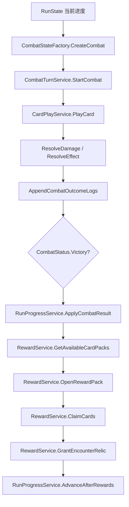

# RoguelikeCardGame MVP 程序调用链路

本文记录第一版 MVP 中，从玩家进入战斗、打出卡牌、造成伤害、击败敌人、战斗胜利，到选择卡包、打开卡包、选择卡片加入牌组的规则层调用链路。

当前阶段尚未接入 Godot 战斗 UI。以下链路描述的是后续表现层应调用的 `Application` 服务，以及这些服务如何读写 `Domain` 状态对象。

## 总览调用图



## 关键状态对象

- `RunState`：定义在 `src/Domain/Runs/RunState.cs`，保存整局 Run 的生命、主卡组 `MasterDeck`、遗物 `RelicIds`、遭遇顺序和当前遭遇索引。
- `CombatState`：定义在 `src/Domain/Combat/CombatState.cs`，保存单场战斗状态，包括玩家生命、防御、行动点、连锁、牌区、敌人状态和结构化日志。
- `DeckZones`：定义在 `src/Domain/Combat/DeckZones.cs`，保存抽牌堆、手牌、弃牌堆。
- `CardDefinition`：定义在 `src/Domain/Cards/CardDefinition.cs`，保存卡牌类型、费用、目标规则、默认连锁变化和效果列表。
- `RewardPackDefinition`：定义在 `src/Domain/Rewards/RewardPackDefinition.cs`，保存奖励包类型、3 张候选牌、最小 / 最大选择数量和重复规则。
- `CombatLogEvent`：定义在 `src/Domain/Combat/CombatLogEvent.cs`，记录 `CardPlayed`、`EffectResolved`、`EnemyDied`、`CombatEnded` 等结构化事件。

## 1. 进入战斗

表现层从当前 `RunState` 和当前遭遇 `EncounterDefinition` 开始。

第一步调用：

```csharp
var combat = combatStateFactory.CreateCombat(
    combatId,
    runState,
    encounter,
    enemiesById);
```

关键类与方法：

- `CombatStateFactory.CreateCombat`：`src/Application/Battle/CombatStateFactory.cs`

该方法负责：

- 根据遭遇创建敌人实例状态。
- 将玩家生命设置为最大生命，满足 MVP 每场战斗开始时生命回满。
- 将 `RunState.MasterDeck` 复制到 `CombatState.DeckZones.DrawPile`。
- 写入 `CombatStarted` 日志。
- 返回 `CombatStatus.NotStarted` 的 `CombatState`。

第二步调用：

```csharp
combat = combatTurnService.StartCombat(combat);
```

关键类与方法：

- `CombatTurnService.StartCombat`：`src/Application/Battle/CombatTurnService.cs`

该方法负责：

- 从 `NotStarted` 进入第 1 回合玩家回合。
- 恢复基础行动点。
- 抽 5 张牌。
- 写入 `CardsDrawn` 和 `TurnStarted` 日志。

## 2. 打出卡牌

玩家点击卡牌并选择目标后，表现层调用：

```csharp
var result = cardPlayService.PlayCard(
    combat,
    cardDefinition,
    targetEnemyInstanceId);
```

关键类与方法：

- `CardPlayService.PlayCard`：`src/Application/Battle/CardPlayService.cs`
- `CardPlayService.CanPlayCard`：`src/Application/Battle/CardPlayService.cs`
- `PlayCardResult`：`src/Application/Battle/CardPlayService.cs`

`PlayCard` 内部会先调用 `CanPlayCard`，检查：

- 当前是否为玩家回合。
- 卡牌是否在手牌中。
- 行动牌行动点是否足够。
- 终结牌是否满足 `min_chain`。
- 单体敌人牌是否有合法目标。

如果失败，`PlayCardResult` 会返回：

- `FailureReason`
- 本地化消息键 `FailureMessageKey`
- 所需 / 当前行动点
- 所需 / 当前连锁
- 所需目标规则
- `CardPlayRejected` 结构化事件

如果成功，`PlayCard` 会：

- 从手牌移除该卡。
- 行动牌扣行动点。
- 写入 `CardPlayed` 日志。
- 逐个结算 `CardDefinition.Effects`。
- 应用默认连锁变化。
- 将打出的牌放入弃牌堆。
- 返回新的 `CombatState` 和本次产生的结构化事件。

## 3. 造成伤害

卡牌效果由 `CardPlayService.ResolveEffect` 分发。

当前 MVP 已支持：

- `damage`
- `block` / `gain_block`
- `draw_cards`
- `gain_action_points`
- `temporary_discount` 占位
- `chain_threshold_bonus`

伤害效果会进入：

```csharp
ResolveDamage(combat, effect, card, targetEnemyInstanceId)
```

关键类与方法：

- `CardPlayService.ResolveEffect`
- `CardPlayService.ResolveDamage`

伤害结算流程：

- 根据卡牌目标规则和效果目标解析敌人列表。
- 先扣敌人 `Block`。
- 剩余伤害扣敌人 `CurrentHp`。
- 敌人生命最低钳制到 0。
- 写入 `EffectResolved` 日志，包含 `damage`、`hp_damage`、`blocked_damage`。

## 4. 击败敌人和战斗胜利

每次成功出牌结尾都会调用：

```csharp
AppendCombatOutcomeLogs(updatedCombat)
```

关键类与方法：

- `CardPlayService.AppendCombatOutcomeLogs`

该方法负责：

- 扫描所有 `CurrentHp <= 0` 且未记录死亡的敌人。
- 为这些敌人写入 `EnemyDied` 日志。
- 如果全部敌人死亡，将 `CombatState.Status` 设置为 `CombatStatus.Victory`。
- 写入 `CombatEnded` 日志。

因此表现层不需要自行判断是否胜利，只需要读取：

```csharp
result.Combat.Status == CombatStatus.Victory
```

## 5. 战斗结果同步到 Run

战斗结束后，表现层调用：

```csharp
runState = runProgressService.ApplyCombatResult(
    runState,
    combat,
    encounter);
```

关键类与方法：

- `RunProgressService.ApplyCombatResult`：`src/Application/Runs/RunProgressService.cs`

规则：

- 如果 `combat.Status == CombatStatus.Defeat`，Run 进入 `RunStatus.Failed`，玩家生命记为 0。
- 如果 `combat.Status == CombatStatus.Victory` 且当前遭遇是 Boss，Run 进入 `RunStatus.Cleared`。
- 普通 / 精英战胜利后，Run 仍保持 `RunStatus.InProgress`，并同步战斗后的玩家生命。

每场战斗开始前可调用：

```csharp
runState = runProgressService.PrepareForCombat(runState);
```

该方法会显式把玩家生命回满。

## 6. 选择卡包

普通 / 精英战胜利后，表现层调用：

```csharp
var packs = rewardService.GetAvailableCardPacks(
    encounter,
    rewardPacksById);
```

关键类与方法：

- `RewardService.GetAvailableCardPacks`：`src/Application/Rewards/RewardService.cs`

该方法负责：

- 读取 `EncounterDefinition.RewardProfile.CardPackIds`。
- 返回可选奖励包列表。
- Boss 遭遇返回空列表。

MVP 普通战斗会提供：

- 行动牌包
- 技能牌包
- 终结牌包

## 7. 打开奖励包

玩家选择某个卡包后，表现层调用：

```csharp
var openedPack = rewardService.OpenRewardPack(
    packId,
    rewardPacksById);
```

关键类与方法：

- `RewardService.OpenRewardPack`

该方法负责：

- 校验奖励包 ID 是否存在。
- 校验候选牌数量是否正好为 3。
- 返回 `RewardPackDefinition`。

表现层可读取：

```csharp
openedPack.CandidateIds
```

用于展示 3 张候选卡。

## 8. 选择卡片加入牌组

玩家可选择 0-3 张候选牌，然后调用：

```csharp
runState = rewardService.ClaimCards(
    runState,
    openedPack,
    selectedCardIds);
```

关键类与方法：

- `RewardService.ClaimCards`

该方法负责：

- 校验选择数量在 `MinPick` 到 `MaxPick` 之间。
- 校验每张选择的牌都属于当前奖励包候选。
- 将选择的卡牌 ID 追加到 `RunState.MasterDeck`。
- 不去重，因此同名牌允许重复加入。

精英战额外遗物通过以下方法发放：

```csharp
runState = rewardService.GrantEncounterRelic(
    runState,
    encounter,
    relicsById);
```

## 9. 奖励后推进到下一场

奖励结算完成后，表现层调用：

```csharp
runState = runProgressService.AdvanceAfterRewards(
    runState,
    encounter);
```

关键类与方法：

- `RunProgressService.AdvanceAfterRewards`

该方法负责：

- 将 `CurrentEncounterIndex` 推进到下一场。
- 将玩家生命回满，为下一场战斗做准备。
- 如果当前遭遇是 Boss，则将 Run 设置为 `RunStatus.Cleared`。

## 当前测试覆盖

规则层 smoke test 位于：

- `tests/Unit/Program.cs`

已覆盖：

- 战斗创建与开战抽牌。
- 卡牌可打出、费用不足、连锁不足、目标缺失。
- 行动牌、技能牌、终结牌默认连锁规则。
- 伤害、防御、抽牌、获得行动点、临时减费占位。
- 敌人死亡、战斗胜利、Run 失败。
- 奖励包选择、打开 3 候选、跳过拿牌、选择多张、重复加入同名牌。
- 精英遗物获得。
- Boss 通关。
- 奖励后线性推进和满血开战。
